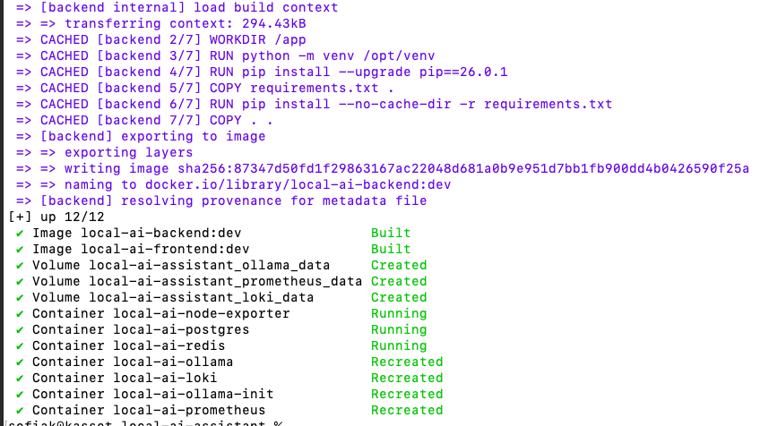
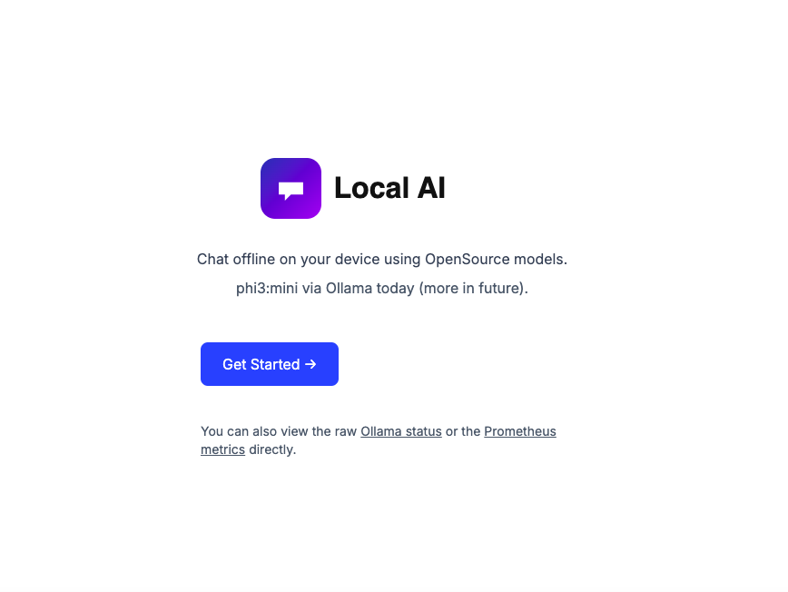
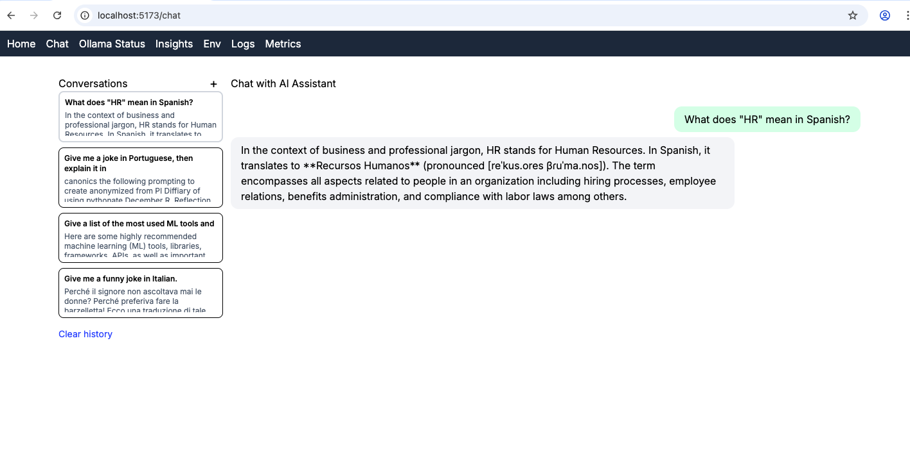
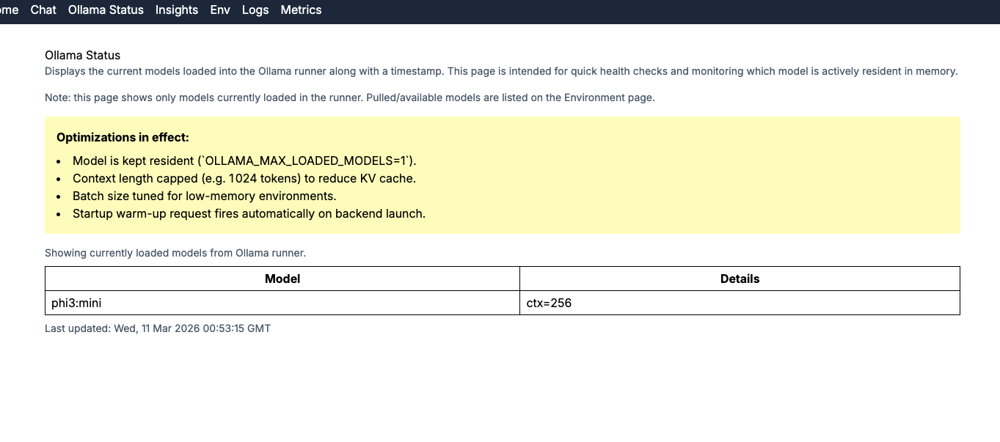
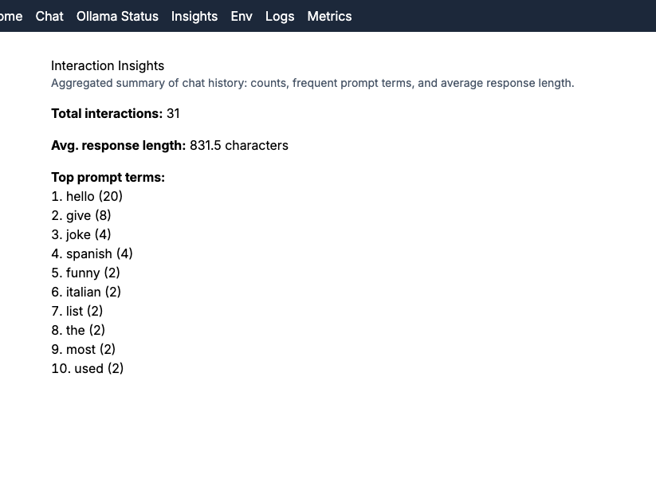
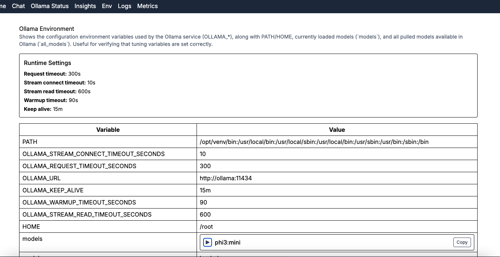
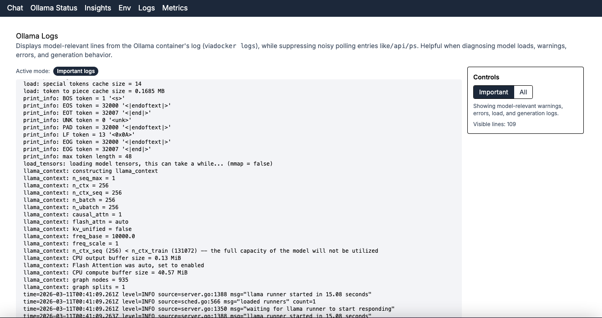
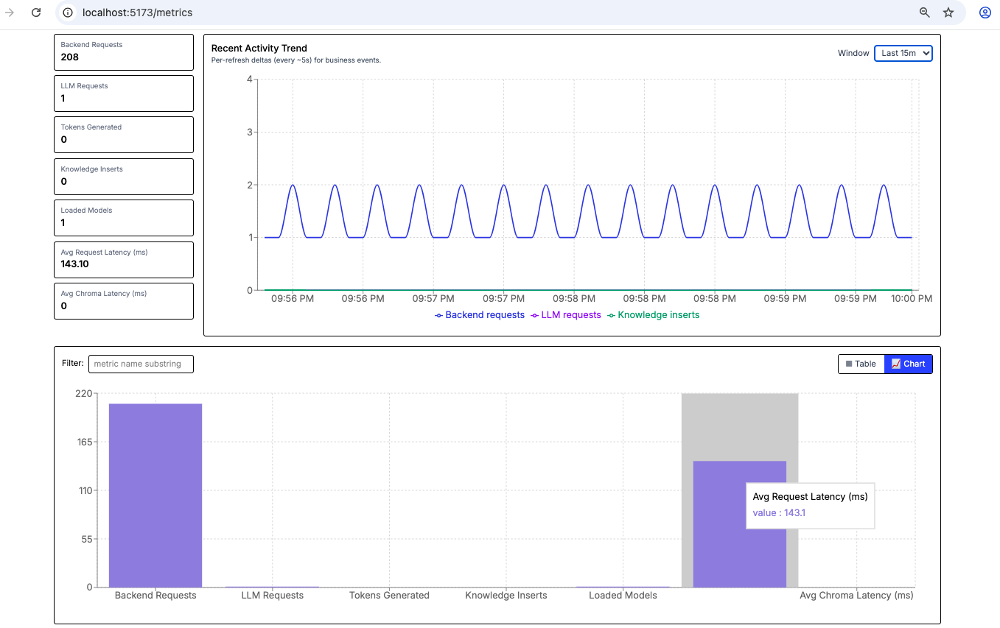
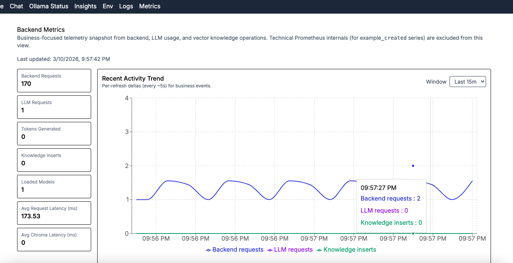
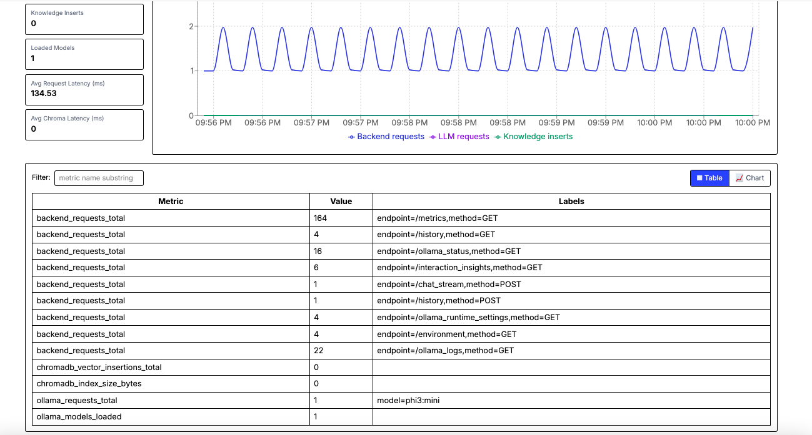

# Local AI Assistant (Docker-First)

This project is a local AI chat assistant that runs as a multi-container stack:

- Frontend: React Router + TypeScript
- Backend: FastAPI
- LLM runtime: Ollama
- Persistence: PostgreSQL
- Cache/state/rate limit: Redis
- Observability: Prometheus + Grafana + Loki + Promtail



## Features Covered in This Repo

- Streaming and non-streaming chat endpoints (`/chat`, `/chat_stream`)
- Redis-backed prompt caching and stream buffering
- Redis-backed runtime flags and per-user rate limiting
- PostgreSQL-backed interaction history (`/history`)
- Runtime/health endpoints (`/health`, `/ollama_status`, `/runtime_status`)
- Prometheus metrics endpoint (`/metrics`)
- Optional local observability stack in development

## Prerequisites

- Docker Desktop (or Docker Engine + Compose v2)
- At least ~8 GB RAM recommended for smooth Ollama + observability usage

## Initial Setup

From the repository root:

```bash
cp .env.example .env
```

Then update `.env` values as needed:

- `POSTGRES_USER`, `POSTGRES_PASSWORD`, `POSTGRES_DB`
- `OLLAMA_VOLUME_PATH`, `BACKEND_VOLUME_PATH`, `FRONTEND_VOLUME_PATH`
- optional: `BACKEND_POSTGRES_URL`, Redis TTL/rate-limit envs

Notes:

- For container-to-container DB access, backend uses `BACKEND_POSTGRES_URL` (host `postgres`).
- `POSTGRES_URL` is intended for host-side tooling.
- Keeping `REDISDATA_VOLUME_PATH` empty uses Docker named volume (safer on macOS permissions).

## Development (Single Command)

Start full development stack (base + override):

```bash
docker compose up --build -d
```

Key endpoints after startup:

- Frontend: `http://localhost:5173`
- Backend API: `http://localhost:8000`
- Prometheus: `http://localhost:9090`
- Grafana: `http://localhost:3000`
- Ollama API: `http://localhost:11434`

Useful commands:

```bash
# stop and remove containers/networks
docker compose down

# include volumes as well
docker compose down -v
```

## Production-Style Run (Same Machine)

Run with base + production overrides:

```bash
docker compose -f docker-compose.yml -f docker-compose.prod.yml up --build -d
```

Published ports in this mode:

- Backend: `http://localhost:80`
- Nginx (fronting frontend): `http://localhost:3000`

Stop production-style stack:

```bash
docker compose -f docker-compose.yml -f docker-compose.prod.yml down
```

## Tests (Backend, in Containers)

Use this exact command:

```bash
docker compose run --rm backend python -m pytest -q
```

Why this form: in this image, `python -m pytest` is more reliable than invoking `pytest` directly for import-path resolution.

## Compose Merge Validation

Inspect final merged service config before running:

```bash
# development merge (base + override)
docker compose config

# production merge (base + prod)
docker compose -f docker-compose.yml -f docker-compose.prod.yml config
```

## API Reference (Quick)

- Chat: `POST /chat`, `POST /chat_stream`, `GET /chat_runtime_status`
- Ollama: `GET /models`, `POST /pull`, `GET /health`, `GET /ollama_status`
- History: `POST /history`, `GET /history`, `GET /history/session/{user}`, `DELETE /history`
- Monitoring: `GET /metrics`, `GET /environment`, `GET /runtime_status`, `GET /interactions`, `GET /interaction_insights`, `GET /ollama_logs`

## Troubleshooting

- First startup may be slow while Ollama images/models are initialized (`ollama-init`).
- If backend can’t reach DB in containers, verify `BACKEND_POSTGRES_URL` host is `postgres`.
- If you change compose envs, re-run `docker compose config` to verify final effective values.

## Screenshots

Once the stack is up you can visit the frontend at `http://localhost:5173`.

1. **Home page**

  

2. **Chat page**

  

3. **Ollama status page**

  

4. **Insights page**

  

5. **Environment page**

  

6. **Logs page**

  

7. **Metrics page**

  <!-- show multiple metrics images side-by-side -->
  
  
  
